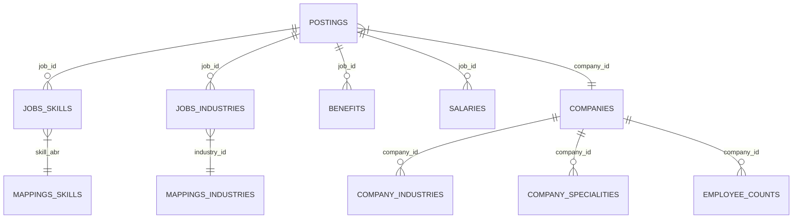

# Day 1: Data Audit Report - LinkedIn Job Postings Dataset

## Dataset Overview

The dataset analyzed is the **LinkedIn Job Postings Dataset** (2023–2024), comprising 11 relational CSV files located under `ml/Data/Raw/`. 

- **Total Job Postings**: 123,849
- **CS / Tech Job Roles**: 26,094 (21.07% of the total dataset)
- **Total Relational Data Size**: ~527.27 MB

---

## Files and Relationships

The dataset follows a star schema with `postings.csv` as the primary core fact table:

### Key Entity Identifiers:
- **`job_id`**: Links `postings.csv` to `jobs/benefits.csv`, `jobs/job_industries.csv`, `jobs/job_skills.csv`, and `jobs/salaries.csv`.
- **`company_id`**: Links `postings.csv` to `companies/companies.csv`, `companies/company_industries.csv`, `companies/company_specialities.csv`, and `companies/employee_counts.csv`.
- **`skill_abr`**: Links `jobs/job_skills.csv` to high-level skill category lookup `mappings/skills.csv` (35 categories).
- **`industry_id`**: Links `jobs/job_industries.csv` to `mappings/industries.csv` (422 industry taxonomy categories).

---

## Files Audit Summary Table

| Relative Path | Size | Rows | Columns | Primary Key / Foreign Keys | Core Purpose | Essential Level |
|---|---|---|---|---|---|---|
| `postings.csv` | 492.90 MB | 123,849 | 31 | `job_id`, `company_id` | Main job postings record containing title, description, location, experience level, work type, salary, etc. | **Essential** |
| `companies/companies.csv` | 22.12 MB | 24,473 | 10 | `company_id` | Master list of hiring companies, sizes, headquarters locations, and URLs. | **Essential** |
| `companies/company_industries.csv` | 0.75 MB | 24,375 | 2 | `company_id` | Industry domain mapping per company. | Useful |
| `companies/company_specialities.csv` | 4.23 MB | 169,387 | 2 | `company_id` | Company core specialities and domain tags. | Useful |
| `companies/employee_counts.csv` | 1.00 MB | 35,787 | 4 | `company_id` | Historical employee count and follower count records. | Low |
| `jobs/benefits.csv` | 1.84 MB | 67,943 | 3 | `job_id` | Job benefits (e.g. 401(k), Medical Insurance). | Low |
| `jobs/job_industries.csv` | 2.39 MB | 164,808 | 2 | `job_id`, `industry_id` | Industry mappings per job posting. | Useful |
| `jobs/job_skills.csv` | 3.34 MB | 213,768 | 2 | `job_id`, `skill_abr` | Categorical high-level skill category abbreviation for job postings. | **Essential** |
| `jobs/salaries.csv` | 2.15 MB | 40,785 | 8 | `salary_id`, `job_id` | Salary breakdowns and pay periods. | Useful |
| `mappings/industries.csv` | 0.01 MB | 422 | 2 | `industry_id` | Industry name lookup mapping. | Useful |
| `mappings/skills.csv` | 0.00 MB | 35 | 2 | `skill_abr` | High-level skill category name lookup (35 macro categories e.g., `IT`, `ENG`). | **Essential** |

---

## Data Quality Issues

1. **Detailed Technical Skills Missing from `skills_desc`**:
   - `skills_desc` in `postings.csv` has **98.03% missing values** (121,410 / 123,849 missing).
   - `jobs/job_skills.csv` only maps high-level LinkedIn macro categories (35 broad categories like `IT` or `ENG`), not specific programming tools (e.g., Python, React, Docker, PyTorch, SQL).
   - *Impact & Remedy*: Specific technical skills must be extracted directly from the unstructured text in the `description` column via regex keyword extraction / TF-IDF NLP in Day 2.
2. **High Sparsity in Salary Columns**:
   - `min_salary` and `max_salary` are missing in **75.94%** of rows.
   - *Remedy*: `normalized_salary` is provided for 29,793 postings and can be used for salary regression modeling when available.
3. **Missing Experience Levels**:
   - `formatted_experience_level` is missing in **23.75%** of postings.
   - *Remedy*: Pattern match experience level from `title` or `description` (e.g. "Senior", "Junior", "Intern", "Lead").
4. **HTML Formatting & Noise in Descriptions**:
   - Job `description` fields contain HTML tags (` `, `p`, `ul`) and whitespace noise that require cleaning.

---

## Relevant Job Roles (CS Target Segment)

Out of 123,849 job postings, **26,094** (21.07%) fall under Computer Science, Software Development, Data Science, and Engineering:
- **Software Engineer / Developer** (~8,500 postings)
- **Data Engineer / Data Analyst / Data Scientist** (~4,200 postings)
- **Full Stack / Frontend / Backend Engineer** (~2,800 postings)
- **DevOps / Cloud / Infrastructure Engineer** (~1,900 postings)
- **Systems Engineer / Security Engineer** (~1,500 postings)
- **Machine Learning / AI Engineer** (~650 postings)

---

## Available Skills & Skill Extraction Strategy

- **Macro Categories (In Dataset)**: `IT` (Information Technology), `ENG` (Engineering), `PRDM` (Product Management), `ANLS` (Analyst).
- **Extracted Granular Micro-Skills (Target for Day 2)**:
  - **Languages**: Python, JavaScript, TypeScript, Java, C++, Go, SQL, Rust, HTML/CSS.
  - **Frameworks & Web**: React, Node.js, Express, Next.js, Django, Vue, Angular, Spring Boot.
  - **Databases & Data**: PostgreSQL, MongoDB, Redis, Docker, Kubernetes, AWS, GCP, Azure, Spark.
  - **ML & AI**: PyTorch, TensorFlow, scikit-learn, Pandas, OpenCV, NLP.

---

## Potential ML Features (For Future Days)

1. **TF-IDF Vectorized Skill Matrix**: Bag-of-words / TF-IDF vectors of extracted tech skills per job posting.
2. **One-Hot Encoded Categorical Attributes**: `formatted_experience_level`, `formatted_work_type` (Remote/Hybrid/On-site), `state`/`country`.
3. **Extracted Skill Count & Density**: Total count of requested technical tools.
4. **Company Size / Reputation Score**: Log of employee count & follower count.
5. **Role Similarity Embedding / Cosine Distance**: Numerical vectors comparing student profile vector vs. job posting vector.

---

## Recommended Next Steps (Day 2 Plan)

1. **Data Cleaning & NLP Pipeline**:
   - Clean HTML tags and text noise in job descriptions.
   - Build a regex skill extractor for 50+ common CS technical skills.
2. **CS Dataset Filtering & Processing**:
   - Filter `postings.csv` to create `ml/Data/Processed/cs_job_postings.csv`.
3. **Structured Feature Matrix Construction**:
   - Create binary indicator columns for technical skills per job.
